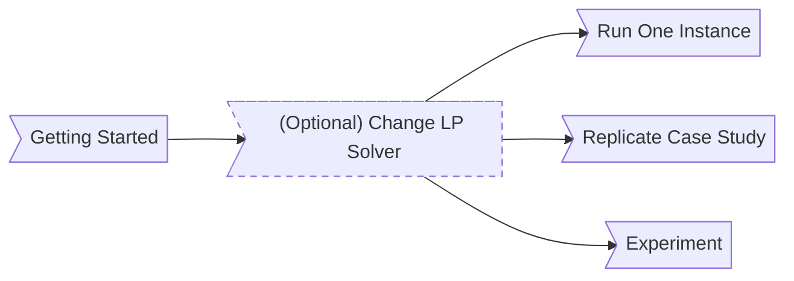

README - Last update: 20241025

THIS IS THE RELEASE BRANCH FOR PAPER:
# On Density-based Local Community Search

Depending on your objective, follow steps as below:


---


### Prerequisites
Julia

### Packages required
Installing packages in Julia for example:
```julia
using Pkg
Pkg.add("MatrixNetworks")
Pkg.add("MAT")
Pkg.add("StatsBase")
Pkg.add("JuMP")
Pkg.add("HiGHS")  # Skip if using other LP Solver
Pkg.add("CSV")
Pkg.add("DataFrames")
```

### Working folder
For all tasks, open cmd/bash, navigate to the repository's root directory, then enter the `./src` folder and run `julia`

---

By default, the LP (Linear-Programming) solver `HiGHS` would be (installed and) used.
If you want to use another LP solver, take `CPLEX` for example, you need to refer to:
- Install [IBM ILOG CPLEX Optimization Studio](https://www.ibm.com/products/ilog-cplex-optimization-studio). You will need to have/obtain a license
- Install [CPLEX for Julia](https://www.ibm.com/products/ilog-cplex-optimization-studio). Including `Pkg.add("CPLEX")`.
- In the file `.\src\LP_load_solver.jl`, comment the blocks using HiGHS and uncomment the blocks using CPLEX.

---


```julia
include("LP_algorithm.jl")
```

### Read/create a graph
Load a toy graph in `./Example_small/` (there are some other toy graphs in the same folder for exploration):

```julia
A = readIN("lobster.in", "../Example_small/")
```

This graph is same as:
```julia
A = sparse([1,1,1,2,2,3,3,4,2,3,4,3,4,4,5,5], [2,3,4,3,4,4,5,5,1,1,1,2,2,3,3,4], ones(Float64, 16), 5, 5)
```

Run GADS under graph `A` with $R = [1,2], x (\omega_{12}) = 1, y (\omega_{24}) = -1$ (see Section 1.4):
```julia
R = [1,2]
x = 1
y = -1
# 7 Numbers in weight corresponds to the Weight Configuration with 10 edge weights as Definition 1 (in paper)
# minus 3 edge weights excluded by Definition 4-C2 (edge weights of edges between V_3 and V_4).
# Note: GADS algorithm only guarantee to work on 0 <= x <= 2, y <= 0 and all other weights same as below.
weight = [2,x,0,0,0,0,y]  # Weight Configuration Ω
ds = DoSolveLocalADS(SOLVER_LP_ADSS, A, R, false, false, DEFAULT_LP_SOLVER, weight)
ds.alpha_star  # The Local Densest Graph of G under weight configuration Ω and seed set R
ds.source_nodes  # The local density of this subgraph
```

---

To reproduce the query demonstrated in A.1 Case Study:

```julia
include("LP_algorithm.jl")
include("CS_DBLP.jl")  # Loading graph and author names, takes time. Variable B would be the dblp graph.
queryID = 8  # The one used in Case Study
dataName = "csdblp"
R = readAnchors(dataName, "Baseline")[queryID]
x = 2
y = 0
weight = [2,x,0,0,0,0,y]
resultSet = DoSolveLocalADS(SOLVER_LP_ADSS, B, R, false, false, DEFAULT_LP_SOLVER, weight).source_nodes  # List of ID of authors of S_{2,0} in Case Study
allNames[resultSet]  # Names of authors of S_{2,0} in Case Study
```

---

Not in the original paper, but you can perform bulk evaluation with a set of seed nodes.

```julia
include("LP_compare_test.jl")
data_name = "csdblp"
# Defines to find seed sets. "Baseline" is default.
# Say your data graph file is .\Example_SCC\csdblp.in
# Then the seed sets file should be prepared as .\AnchorNodes\Baseline\csdblp.anchor
seedset_folder="Baseline"
# For solvers:
# Set the 1st entry to true to evaluate the flow network algorithm (FNLA) in paper "Anchored Densest Subgraph".
# Set the 2nd entry to true to evaluate the linear programming based algorithm (LPLAS) in this paper with edge weights = weight.
# Note that weight only affects LPLAS, as FNLA only works on one specific edge weights.
solvers = [false, true]
x = 1
y = -1
weight = [2,x,0,0,0,0,y]
test_name = "myTest"  # Change output folder
seedset_size = 100  # Evaluate first seedset_size many seed sets of the aforementioned seed sets file. 0 means all in seed sets file.
BulkProcessAndOutputAlgorithms(dataset_names, solvers, weight, test_name, seedset_size)
ProcessAndOutputAlgorithms(data_name, anchorsType="Baseline", solvers, weight, test_name, seedset_size)
```
The output files would appear under `.\LPCompResults\`. For example, the above test would produce these 2 files:
- `csdblp-LPLAS-myRun.lpcompsets`: result set of each evaluation
- `csdblp-LPLAS-myRun.lpcompstats`: stats:
    - alpha: max local density
    - ext_time: total time taken
    - int_time: For LPLAS, (sum of) time taken reported by LP solver only. For FNLA equals to ext_time
    - lnsize: Number of nodes in the last working graph (of the local algorithm)
    - lmsize: Number of edges in the last working graph
    - iters: number of iterative expansions
    - ssize: cardinality of the result set


------


This algorithm can work on other data graphs you downloaded, for example, [uk2007](http://konect.cc/networks/dimacs10-uk-2007-05/) (large!).  
All our experimental data graphs can be found at [SNAP](https://snap.stanford.edu/data/index.html), [KONECT](http://konect.cc/) and [Network Repository](https://networkrepository.com/networks.php).

In our experiment, we preprocessed all the data graphs we used so that they can be loaded by `readIN()` (see above for syntax):  
- The first line contains two integers - the number of vertices (**n**) and the number of edges (**m**), respectively.
- For the next **m** lines, each line contains two integers representing an (unweighted, undirected) edge; all vertices are 1-indexed.
- Any contents after these **m** lines will not be processed; Any line starts with `#` and `%` is ignored. 

If it does not meet the above conditions, you may need to preprocess the raw data first.

Example of a legitimate .in file:  
```
% "Lobster" toy graph
# 4-clique:
5 8  
1 2  
1 3  
1 4  
2 3  
2 4  
3 4  
# + An extra extruding triangle:
3 5  
4 5  

This line is also a comment.
```

Alternatively, a `readRaw()` does the same as `readIN()` but assumes the file does not have a header line for # vertices and # edges.  
Instead, you pass the number of vertices and the number of edges as the parameters:

```julia
A = readRaw("zebra.txt", 27, 111, "../Example_raw")
```

------


This code is a fork of [HypergraphFlowClustering](https://github.com/nveldt/HypergraphFlowClustering) by [Nate Veldt](https://github.com/nveldt). We are grateful for [Nate Veldt]'s contributions, such as:
- `maxflow.jl` with modifications.
