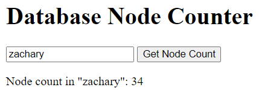

# FastAPI with Neo4j Project

This project demonstrates how to integrate FastAPI with a Neo4j database to perform operations like counting nodes in a specified database. The application provides a simple web interface where users can submit requests and view responses directly.

## Prerequisites

Before you begin, ensure you have the following installed:
- Python 3.6+
- Neo4j Database

## Installation

Follow these steps to set up and run the project locally:

### 1. Clone the Repository
Start by cloning the repository to your local machine:

```bash
git clone https://your-repository-url.git
cd your-repository-directory
```

### 2. Set Up Python Environment
It's recommended to use a virtual environment to manage the dependencies:

```bash
python -m venv venv
source venv/bin/activate  # On Windows use `venv\Scripts\activate`
```

### 3. Install Dependencies
Install all required packages using the requirements.txt file:

```bash
pip install -r requirements.txt
```

### 4. Configure Neo4j Connection
Ensure your Neo4j database is running. Update the connection settings in the application code if necessary, specifically the username, password, and URI in the FastAPI application logic.

## Running the Application
To start the FastAPI server, use the following command:

```bash
uvicorn app.main:app --reload
```
This command starts the server with live reloading enabled, making it useful for development.

## Accessing the Application
Once the server is running, you can access the application by navigating to:

```
http://localhost:8000/
```

This URL serves the index.html page where you can interact with the application:

- Enter the name of the database you want to query.
- Click the "Get Node Count" button to fetch the number of nodes from the specified Neo4j database.
- The result will be displayed on the same page below the button.



## Project Structure

Here's a breakdown of the key directories and files within this project:

- **`app/`**: Contains the FastAPI application code.
  - **`main.py`**: The main FastAPI application file where routes are defined and the app is configured.
- **`templates/`**: Stores HTML files used as templates or static pages for the web interface.
  - **`index.html`**: The main user interface where users can input data and see results.
- **`static/`**: (Optional) This directory should contain static resources like CSS, JavaScript, and images.
  - `/css` or `/js`: Subdirectories for organizing CSS stylesheets and JavaScript files respectively.
- **`requirements.txt`**: A file listing all necessary Python libraries that need to be installed to run this project.

